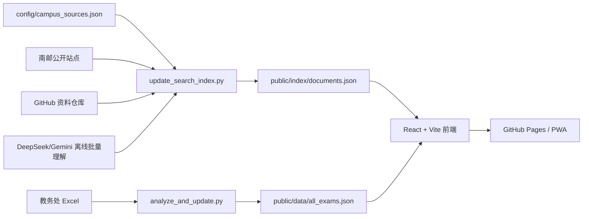

# njupt-search

<div align="center">


**南邮学生的信息入口：搜任务、搜截止、搜名单、搜讲座、搜服务、搜资料。**

[在线使用](https://njupt.hicancan.top) · [报告 Bug](https://github.com/hicancan/njupt-search/issues) · [路线图](docs/njupt-search-product-roadmap.md)


</div>

---

## 项目定位

`njupt-search` 致力于将分散在南邮各个公开站点里的学生相关信息，整合为一个可搜索、可过滤、可持续更新的极速校园信息入口。

当前版本内置了独立的考试垂直频道：输入班级号即可查看期末考试安排、手动勾选课程并导出 `.ics` 日历。除此之外，全局搜索结果接入了源注册表、离线 LLM 清洗、多轴分类、行动事项、截止时间、学院站和开源 GitHub 资料仓库。

## 已接入数据

校园公开源配置位于：

```text
config/campus_sources.json
```

当前源注册表按 Tier 接入：

| 层级 | 源 | 主要内容 |
| --- | --- | --- |
| Tier 0 | 教务、学工、研究生、研工、团委、创新创业、就业、图书馆、保卫、后勤 | 学生刚需事务 |
| Tier 1 | 学校官网通知、官网首页、新闻网、信息公开、国际合作交流处 | 校级公开信息流 |
| Tier 2 | 计算机、通信、电光、集成电路、自动化、人工智能、物联网、理学院、现代邮政、管理、经济等学院 | 学院通知、答辩、竞赛、实习、项目 |
| Tier 3 | 科学技术处、社会科学处、学科建设办公室、产业合作处等 | 项目、科研机会、讲座，默认强过滤 |

索引产物位于：

```text
public/index/documents.json
public/index/manifest.json
```

GitHub 资料源配置仍位于：

```text
config/github_search_sources.json
```

考试数据仍位于：

```text
public/data/all_exams.json
public/data/data_summary.json
```

## 核心能力

- 统一搜索：公告、考试记录、就业宣讲、项目文档、学院通知和学习资源进入同一排序模型。
- 多轴理解：搜索和筛选不再依赖旧一级分类频道，主体验使用 `domain`、`intent`、`source_type`、`lifecycle`、`deadline`、`evidence`。
- 默认过滤：入库时过滤低学生相关内容，结果页按相关度和发布时间展示。
- 任务卡片：结果页展示事务领域、动作类型、生命周期、截止时间、行动说明、附件角色和敏感标记。
- 考试垂直频道：班级号搜索、模糊班级选择、手动勾选考试、导出标准 iCalendar。
- 自动更新：GitHub Actions 每 6 小时更新考试数据、校园搜索索引和已配置 GitHub 资料源，并执行索引契约校验。
- PWA / Android TWA：支持添加到主屏幕，缓存 `/data/` 和 `/index/` 数据并监听后台更新。

## 本地开发

> 需要 Node.js >= 20。Windows 环境建议使用 PowerShell 7。

```powershell
npm install
npm run dev
```

生产构建：

```powershell
npm run build
```

质量检查：

```powershell
npm run typecheck
npm run lint
npm test
```

## 数据更新

安装 Python 依赖：

```powershell
uv pip install -r requirements.txt
```

更新考试 Excel 与结构化考试数据：

```powershell
uv run python scripts\auto_update_exam_data.py
uv run python scripts\analyze_and_update.py
```

更新校园搜索索引：

```powershell
uv run python scripts\update_search_index.py
```

常用参数：

```powershell
uv run python scripts\update_search_index.py --dry-run --no-llm
uv run python scripts\update_search_index.py --source jwc --force-llm --limit 20
uv run python scripts\update_search_index.py --llm-provider deepseek --llm-batch-size 32
uv run python scripts\update_search_index.py --no-github
```

索引契约校验：

```powershell
uv run python scripts\validate_search_index.py
```

官方公开源审计：

```powershell
uv run python scripts\audit_njupt_sources.py
```

### LLM 增强清洗

校园搜索索引支持可选的离线 LLM 清洗。未配置 Key 时会自动回退到规则分类；配置后只在索引构建阶段调用，不会在用户搜索时实时调用模型。默认 provider 为 `auto`：优先使用 DeepSeek V4 Flash，未配置时回退到 Gemini。

可选环境变量：

```powershell
$env:DEEPSEEK_API_KEY="..."
$env:DEEPSEEK_MODEL="deepseek-v4-flash"
$env:DEEPSEEK_API_BASE="https://api.deepseek.com"
$env:GEMINI_API_KEYS="key1,key2,key3"
$env:LLM_BATCH_MAX_DOCS="32"
$env:LLM_BATCH_MAX_CHARS="250000"
```

LLM 清洗会写入二级分类、学生相关性、行动事项、截止时间、材料清单、学生视角摘要、附件角色、敏感信息标记、复核标记和 evidence。索引脚本同时包含 `llm_schema_version`、受限页面识别、Python 侧 Pydantic 校验、批量 JSON 输出校验、候选级持久缓存、可重跑参数和规则兜底，避免旧缓存或格式漂移污染线上 `documents.json`。

候选级 LLM 缓存位于 `cache/search_llm_cache.json`，只保存 URL、hash、标题和结构化结果，不保存正文。常规更新复用缓存；需要全量重跑时使用：

```powershell
uv run python scripts\update_search_index.py --force-llm --llm-provider deepseek
```

CI 中如需读取 GitHub 资料仓库，请配置仓库级 Actions secret：

```powershell
gh auth token | gh secret set NJUPT_SEARCH_GITHUB_TOKEN --repo hicancan/njupt-search
```

数据流水线：



## 项目结构

```text
njupt-search/
├── docs/
│   └── njupt-search-product-roadmap.md
│   └── source-audit.md
├── config/
│   ├── campus_sources.json
│   └── github_search_sources.json
├── public/
│   ├── data/                  # 考试垂直频道数据
│   ├── index/                 # 校园搜索索引
│   └── assets/
├── scripts/
│   ├── auto_update_exam_data.py
│   ├── analyze_and_update.py
│   ├── indexer_config.py
│   ├── indexer_scoring.py
│   ├── semantic_model.py
│   ├── validate_search_index.py
│   ├── audit_njupt_sources.py
│   ├── llm_scorer.py
│   └── update_search_index.py
├── src/
│   ├── components/
│   ├── hooks/
│   ├── types/
│   └── utils/
└── .github/workflows/
    ├── auto-update.yml
    ├── deploy.yml
    └── build-apk.yml
```

## 免责声明

- 只抓取公开网页与公开接口，不接入需要登录的系统。
- 考试信息由教务处公开 Excel 自动解析生成，最终时间地点请以学校教务系统及准考证为准。
- 公告索引依赖各站点公开页面可用性，若源站短暂异常，`manifest.json` 会记录源级状态。

## License

[MIT](LICENSE)
